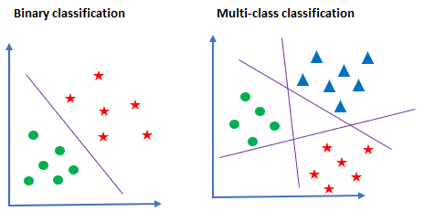
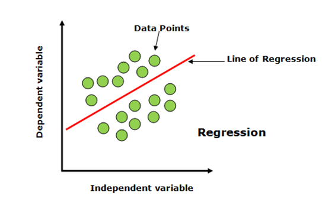
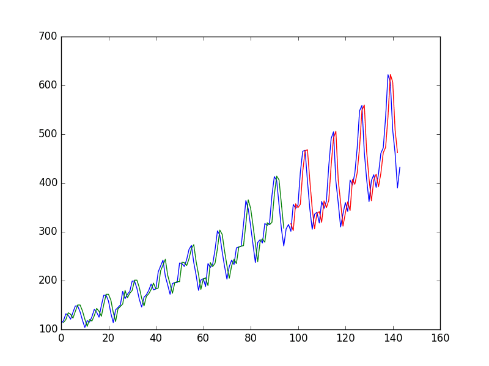
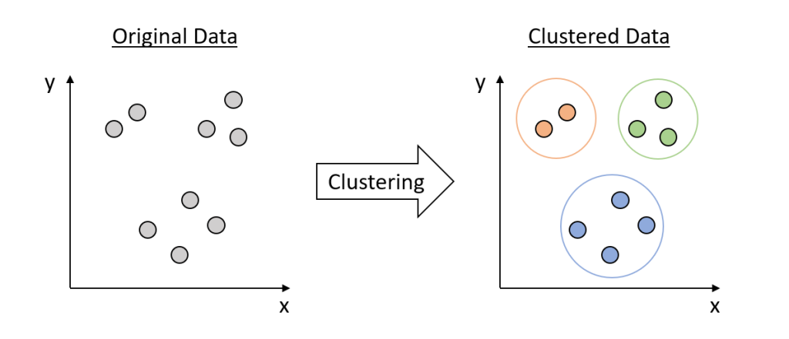
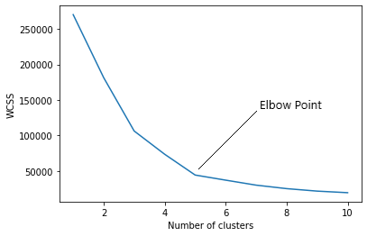
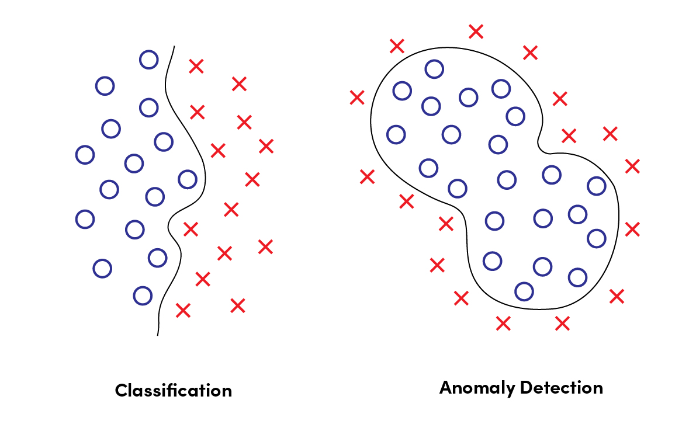

## Modules in pycaret
#### Binary Classification
In a binary classification task, the goal is to classify the input data into two mutually exclusive categories. The training data in such a situation is labeled in a binary format: true and false; positive and negative; O and 1; spam and not spam, etc. depending on the problem being tackled.

---
#### Multiclass Classification
Multiclass classification is the process of assigning entities with more than two classes. Each entity is assigned to one class without any overlap. An example of multiclass classification, using images of vegetables, where each image is either a carrot, tomato, or zucchini.

---
#### Regression
Machine Learning Regression is a technique for investigating the relationship between independent variables or features and a dependent variable or outcome. It's used as a method for predictive modelling in machine learning, in which an algorithm is used to predict continuous outcomes

---

#### Time Series Forecasting

Time-series forecasting is a type of statistical or machine learning approach that tries to model historical time-series data in order to make predictions about future time points.

---

#### Clustring
It means to find out groups on the basis of data.

Clustering is a Machine Learning algorithm and a popular technique for classifying data. It falls under the category of unsupervised machine learning algorithms as it's useful in dealing with unlabeled and unstructured data. \
Clustering is a great way to start making sense out of unstructured data.

**Elbow Method**\
The elbow method is a technique used in clustering analysis to determine the optimal number of clusters. It involves plotting the within-cluster sum of squares (WCSS) for different cluster numbers and identifying the “elbow” point where WCSS starts to level off

---

#### Anomally detection
Anomaly detection in machine learning is the process of using machine learning models to identify anomalies rapidly. This serves several purposes, whether to maintain clean, high-quality data that you will use for processing or specific business purposes.
It means to distribute normal data 

